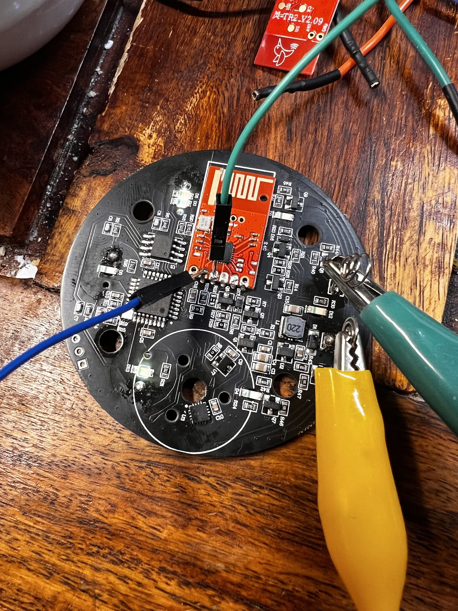
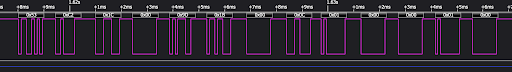
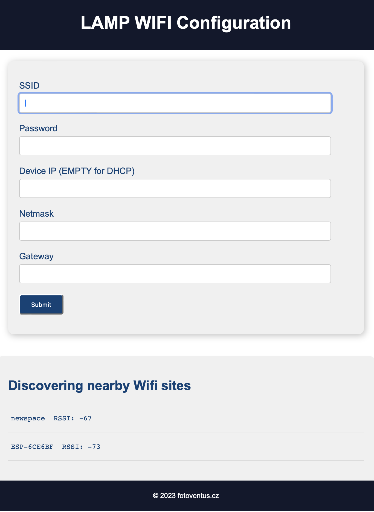
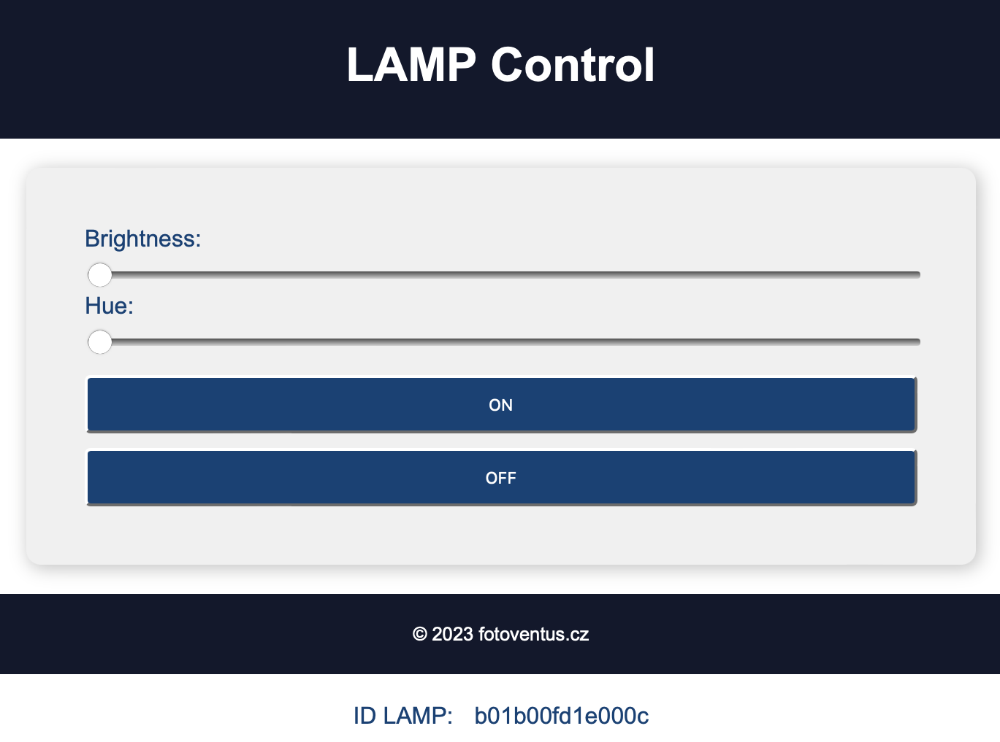

# LAMP

Elesense Light Bar is a monitor lamp from [kickstarter](https://www.kickstarter.com/projects/elesense/elesense-computer-monitor-light-bar). Because of the need to control it using a web interface or script and also out of curiosity how it works, this project was created. Take a screwdriver and an anlyzer and see how it works.....  

## Hardware
For communication is to use LC12S module communicating on 2.4GHz. It is used as a transparetic serial line at 9600bps. 
For the control of the LAMP project the ESP32 module is used. The development was based on ESP-WROVER-KIT. 

[Wiring the lamp controller based on ESP32](https://github.com/xventus/Elesense-Light-Bar/blob/master/hw/schema.pdf) 

Still in development, custom PCB is being created, will be published in time. 

---
| ESP32 GPIO  | Note         |
|------------|---------------|
|   GPIO_NUM_25 | LSC12S TX |
|   GPIO_NUM_26 | LSC12S RX |
|   GPIO_NUM_19 | LSC12S SET |
|   GPIO_NUM_18 | LSC12S CS |
|   GPIO_NUM_2  | A BUTTON |
|   GPIO_NUM_4  | B BUTTON |
|   GPIO_NUM_0  | FLASH BUTTON |
|   GPIO_NUM_5  | HEART BEAT LED |

## Protocol

example: 

`0x53 0xC2 0x1C 0x00 0x9D 0x1B 0x00 0x0E 0x01 0x17 0x0E 0x26 0x00` 

---
| Byte position  | Note |
|------------|------------------------------------------------------------------------|
| 0          | header  (always 0x53)                                                  |
| 1          | lampID-1  (0xC2)                                                       |
| 2          | lampID-2  (0x1C)                                                       |
| 3          | lampID-3  (always 0x00)                                                |
| 4          | lampID-4  (0x9D)                                                       |
| 5          | lampID-5  (0x1B)                                                       |
| 6          | lampID-6 (always 0x00)                                                 |
| 7          | lampID-7  (0x0E) (if 0xA4 appears then the rest of the octet is 0x00)  |
| 8          | command  0x01 - ON,  0x10 - OFF, 0x02 - Automatic dimming       (0x01) |
| 9          |0x00 - 0x17 intensity (0x00 - min intensity, 0x17 - max intensity), note: when off  0x10 (0x17) |
| 10         |0x00 - 0x17 intensity (0x00 - Yellow MAX, 0x17 - Yellow Min), note: when off 0x10  ([0x0E)      | 
| 11         | Checksum  = Sum of [8] + [9] + [10]   (0x26)                                                   |
| 12         | END mark   (always 0x00)                                                                       |

## HTTP command

LAMP OFF command

`curl -X POST -H "Content-Type: application/json" -d '{"command": "OFF"}' http://xxx.xxx.xxx.xxx/command`

LAMP ON with intensity and hue command

`curl -X POST -H "Content-Type: application/json" -d '{"command": "ON","brightness":"17","hue":"12"}' http://xxx.xxx.xxx.xxx/command`

LAMP get ID & values

`curl http://192.168.2.222/values`

## Web interface

