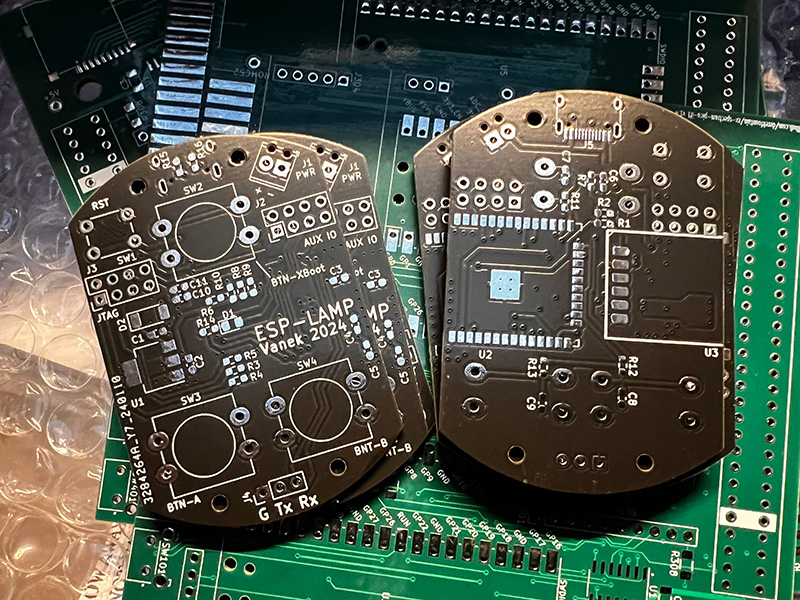
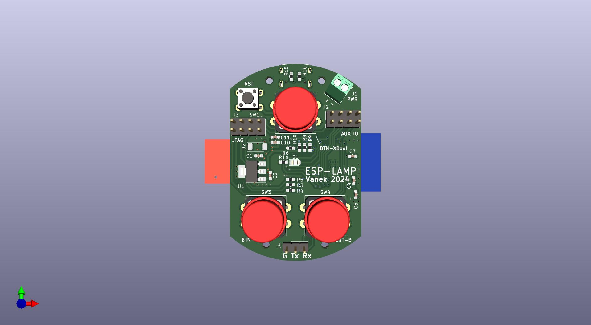
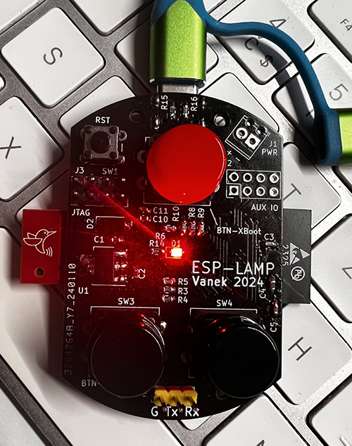

# LAMP

Elesense Light Bar is a monitor lamp from [kickstarter](https://www.kickstarter.com/projects/elesense/elesense-computer-monitor-light-bar). Because of the need to control it using a web interface or script and also out of curiosity how it works, this project was created. Take a screwdriver and an anlyzer and see how it works.....  

<table>
    <tr>
        <td></td>
        <td></td>
        <td></td>
        <td></td>
    </tr>
</table>

## Hardware
For communication is to use LC12S module communicating on 2.4GHz. It is used as a transparetic serial line at 9600bps. 
For the control of the LAMP project the ESP32 module is used. The development was based on ESP-WROVER-KIT. 

[Wiring the lamp controller based on ESP32](https://github.com/xventus/Elesense-Light-Bar/blob/master/hw/schema.pdf) 

The first version of the board is made. Gerber is in the hw directory. 

[Interactive BOM](https://fotoventus.cz/lamp/ibom.html)

Still in development, custom PCB is being created, will be published in time. 

---
| ESP32 GPIO  | Note         |
|------------|---------------|
|   GPIO_NUM_25 | LSC12S TX |
|   GPIO_NUM_26 | LSC12S RX |
|   GPIO_NUM_19 | LSC12S SET |
|   GPIO_NUM_18 | LSC12S CS |
|   GPIO_NUM_2  | A BUTTON |
|   GPIO_NUM_4  | B BUTTON |
|   GPIO_NUM_0  | FLASH BUTTON |
|   GPIO_NUM_5  | HEART BEAT LED |

## Protocol

example: 

`0x53 0xC2 0x1C 0x00 0x9D 0x1B 0x00 0x0E 0x01 0x17 0x0E 0x26 0x00` 

---
| Byte position  | Note |
|------------|------------------------------------------------------------------------|
| 0          | header  (always 0x53)                                                  |
| 1          | lampID-1  (0xC2)                                                       |
| 2          | lampID-2  (0x1C)                                                       |
| 3          | lampID-3  (always 0x00)                                                |
| 4          | lampID-4  (0x9D)                                                       |
| 5          | lampID-5  (0x1B)                                                       |
| 6          | lampID-6 (always 0x00)                                                 |
| 7          | lampID-7  (0x0E) (if 0xA4 appears then the rest of the octet is 0x00)  |
| 8          | command  0x01 - ON,  0x10 - OFF, 0x02 - Automatic dimming       (0x01) |
| 9          |0x00 - 0x17 intensity (0x00 - min intensity, 0x17 - max intensity), note: when off  0x10 (0x17) |
| 10         |0x00 - 0x17 intensity (0x00 - Yellow MAX, 0x17 - Yellow Min), note: when off 0x10  ([0x0E)      | 
| 11         | Checksum  = Sum of [8] + [9] + [10]   (0x26)                                                   |
| 12         | END mark   (always 0x00)                                                                       |

## HTTP command

LAMP OFF command

`curl -X POST -H "Content-Type: application/json" -d '{"command": "OFF"}' http://xxx.xxx.xxx.xxx/command`

LAMP ON with intensity and hue command

`curl -X POST -H "Content-Type: application/json" -d '{"command": "ON","brightness":"17","hue":"12"}' http://xxx.xxx.xxx.xxx/command`

LAMP get ID & values

`curl http://192.168.2.222/values`

## HW Buttons

---
| Button     | Note |
|------------|------------------------------------------------------------------------|
| X-BOOT + reset |  Upoad firmware via serial 
| X-BOOT     |  ON / OFF |
| A     | Increasing the brightness intensity|
| B     | Decreasing the brightness intensity|
| A + B + reset | New initialization, creates a LAM AP and allows you to set up a new WiFi connection | 

## Programming and configuration

Note!!:  Resistor R10 is used on GPIO2, it is necessary to ground it during upload. Press the push button or insert the shorting jumper on the push button.

1. Connect ESP-LAM PCB via 3V3 USB-serial converter to J4 connector
2. Connect power via USB-C connector or via J1
3. Run VisualCode and upload the project
4. In VC Platformio run Build Sytem File Image
5. Press and hold the BTN-XBOOT button and press the RST button, then release RST and BTN-XBOOT 
7. In VC Platformio run Upload Sytem File Image
8. Press and hold the BTN-XBOOT button and press the RST button, then release RST and BTN-XBOOT
9. In VC Platformio, start the Upload Program to ESP
10. Press the RST button, then the LED should start flashing 
11. On your computer, search for the AP named LAMP AP and connect
12. In your web browser enter the address http://192.168.4.1
13. Configure the wifi network and select submit
14. After reboot, ESP-LAMP will connect to your wifi network and you can connect from the browser to the IP address received from DHCP or specified in the configuration and control the lamp.  

## LED STATE

---
| LED     | Note |
|------------|------------------------------------------------------------------------|
| .. .. .. |  LAMP runs in AP mode and waits for configuration |
| . -  . - |  The LAMP is waiting to be paired. Please use the original control for the lamp. ESP-LAMP will copy the lamp ID.   |
| - - - -  |  LAMP connected to wifi and works |
| . . . . .|  Error |

## Web interface

